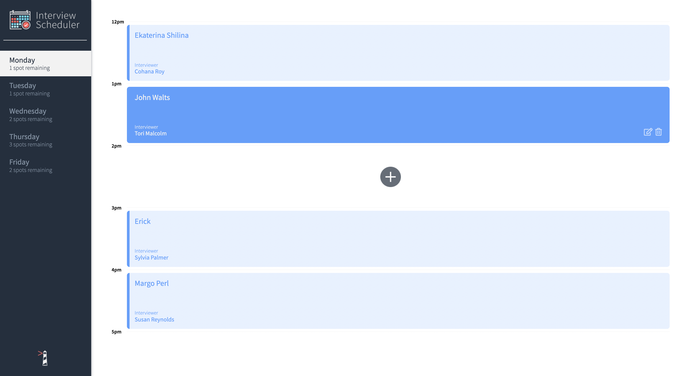
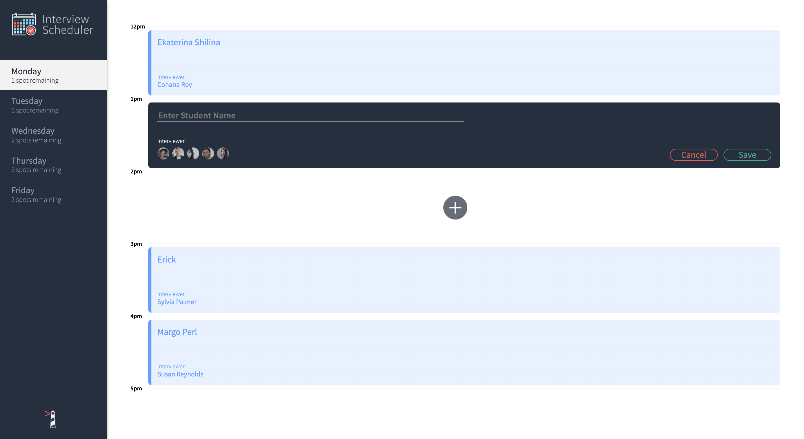
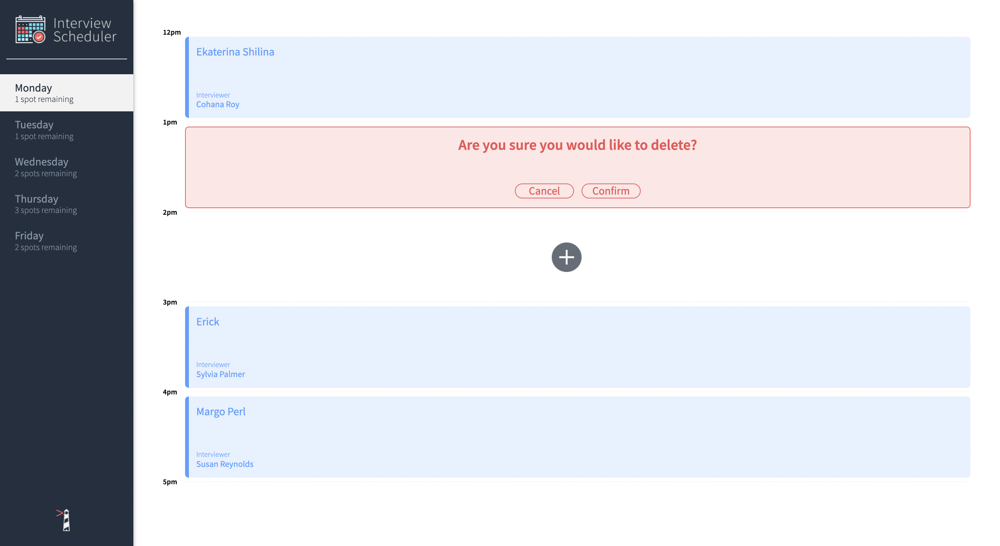
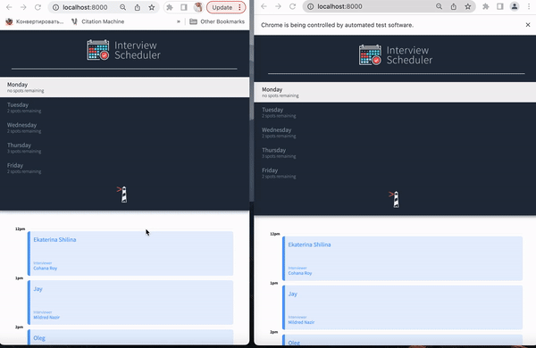

# About Interview Scheduler
  Interview Scheduler is a single-page application (SPA) that allows users to book technical interviews between students and mentors. Appointments can be scheduled between 12 PM and 5 PM, Monday to Friday. Each appointment consists of one student and one interviewer. When creating a new appointment, the user can enter the name of any student, while the interviewer is selected from a predefined list. The user can save the appointment and view the entire schedule of appointments for any day of the week. Additionally, appointments can be edited or deleted.
  WebSocket API has been implemented to establish a persistent connection between the scheduler API server and clients. Whenever an appointment is created or deleted, a message containing the updated data is sent to all connected clients.
  The front end of this project is built with React, and it makes requests to an API to fetch and store appointment data from a database.

  ## Build with:
* React
* Axios
* WebSocket API
* PostgreSQL
* Express
* Node.js
* Storybook
* Cypress
* Jest

## User Requirements / Story Book
* Interviews can be booked between Monday and Friday.
* A user can switch between weekdays.
* A user can book an interview in an empty appointment slot.
* Interviews are booked by typing in a student name and clicking on an interviewer from a list of available interviewers.
* A user can cancel an existing interview.
* A user can edit the details of an existing interview.
* The list of days informs the user how many slots are available for each day.
* The expected day updates the number of spots available when an interview is booked or canceled.
* A user is presented with a confirmation when they attempt to cancel an interview.
* A user is shown an error if an interview cannot be saved or deleted.
* A user is shown a status indicator while asynchronous operations are in progress.
* When the user presses the close button of the error they are returned to the Form or Show view (skipping Status and Confirm).
* The application makes API requests to load and persist data. We do not lose data after a browser refresh.

## Project Outcomes
* Use React to create a single page application (SPA) called Interview Scheduler
* Have the client application communicate with an API server over HTTP, using Axios to make calls to the API.
* Gain experience with different development environments, including Storybook, Jest, and Webpack Dev Server, Cypress

## Learning Outcomes
* Analyze and understand how to break up the UI into sections of appropriate components
* Use the React library to build components using JSX
* Understand common techniques when composing a UI with React such as rendering lists of components and conditional rendering
* Understand fundamental concepts of how data is stored and passed between components, including state and props
* Understand how events are handled in React
* Understand controlled components, and how React is used to manage the state of data in form inputs
* Manage the visual state of the application including create, edit and delete capabilities
* Implement advanced React patterns to manage the state and add live updates.
* Learning to build custom Hooks to organize and share logic.
* Retrieve data from an API using Axios
* Understand how client request work in React and how to employ the useEffect hook
* Test the appearance and behavior of components in isolation using Storybook
* Test helper functions using Jest
* Learning to use a reducer pattern for complex state management. 
* Implemented WebSocket API to establish a persistent connection between the scheduler API server and clients. Whenever an appointment is created or deleted, a message containing the updated data is sent to all connected clients.

## Work Outcomes
* Troubleshoot and debug problems associated with web development in React.
* Evaluate or analyze coding solutions/ideas, and their limitations and/or benefits.
* Contribute to full-stack web applications using modern software development patterns, tools, and workflows.
* Integrate into common development team workflows (git, Github workflow, automated testing, and code reviews).


## Getting Started

1. Clone the repository from GitHub
2. Install dependencies in the project directory
```sh
npm install
```
3. Running Webpack Development Server

```sh
npm start
```
4. Open the application on [http://localhost:8000](http://localhost:8000) in your web browser
5. Run the backend server by using the instructions here: [https://github.com/lighthouse-labs/scheduler-api](https://github.com/lighthouse-labs/scheduler-api)

## Dependencies :
`"axios":` "^0.20.0",

`"classnames":` "^2.2.6",

` "normalize.css": ` "^8.0.1",

` "react":` "^16.9.0",

`"react-dom":` "^16.9.0",

`"react-scripts":` "3.4.4"
### devDependencies :
 `"@babel/core":`  "^7.4.3",

`"@storybook/addon-actions":` "^5.0.10",

`"@storybook/addon-backgrounds": `"^5.0.10",

`"@storybook/addon-links": `"^5.0.10",

`"@storybook/addons": `"^5.0.10",

`"@storybook/react":` "^5.0.10",

`"@testing-library/jest-dom": `"^4.0.0",

`"@testing-library/react": `"^8.0.7",

`"@testing-library/react-hooks": `"^8.0.1",

`"babel-loader": `"8.1.0",

`"prop-types": `"^15.8.1",

`"react-test-renderer": `"^16.9.0",

`"sass": `"^1.53.0"


## Running Jest Test Framework
The project includes both unit and integration tests using the Jest test framework. To run the tests, use the following command:

```sh
npm test
```
This will execute all the test suites and display the results in the terminal.
## Running Storybook Visual 

The project uses Storybook to build and showcase components in isolation. To run Storybook and explore the components, use the following command:

```sh
npm run storybook
```
This will start Storybook and open it in your browser at [http://localhost:9009](http://localhost:9009)

## Running Cypress End-to-End Tests
- Prepare the database by duplicating the `.env.development `file and name the new copy `.env.test` inside the [scheduler_api repo.](https://github.com/lighthouse-labs/scheduler-api) In that new file, change only the PGDATABASE value to scheduler_test.

```sh
REACT_APP_WEBSOCKET_URL=ws://localhost:8001
PORT=8000
CHOKIDAR_USEPOLLING=false

PGHOST=localhost
PGUSER=development
PGDATABASE=scheduler_test # this line
PGPASSWORD=development
PGPORT=5432
```

- Create a new database called scheduler_test. We will run psql to perform this operation :

```sh
psql
CREATE NEW DATABASE scheduler_test;
```
* Run the [scheduler_api](https://github.com/lighthouse-labs/scheduler-api) server on the Host machine with :

```sh
NODE_ENV=test npm start
npm run test:server
```
* Reset the test database by making a GET request to [http://localhost:8001/api/debug/reset.](http://localhost:8001/api/debug/reset)
* If properly set it up, we will see `CREATE DATABASE` in terminal, then check the list of databases by typing : 

```sh
\l
```
* Connect to database "scheduler_test" and test that the seed data is correct by running this commands :

 ```sh
 \c scheduler_test;
 ``` 
 

 ```sh
 SELECT * FROM days JOIN appointments ON appointments.day_id = days.id LEFT JOIN interviews ON interviews.appointment_id = appointments.id ORDER BY appointments.id;
```

```sh
 id |  name   | id | time | day_id | id |   student    | interviewer_id | appointment_id 
----+---------+----+------+--------+----+--------------+----------------+----------------
  1 | Monday  |  1 | 12pm |      1 |  1 | Archie Cohen |              1 |              1
  1 | Monday  |  2 | 1pm  |      1 |    |              |                |               
  2 | Tuesday |  3 | 12pm |      2 |    |              |                |               
  2 | Tuesday |  4 | 1pm  |      2 |    |              |                |               
(4 rows)

scheduler_test=# \q

```

* Run Cypress:

```sh
 npm run cypress
 ```

* Select one of the following test files to run:

```sh
cypress/integration/navigation.spec.js

cypress/integration/appointments.spec.js
```


## Screenshot of Application

###  Appointment form



### Edit form

### Delete form


## Demo 
#### When an appointment is created or deleted, the updated data is sent to all connected clients in real time.

